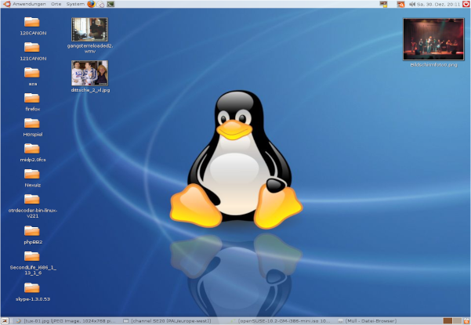

---
tags:
  - Reference
---

# Media

=== "Images"

    ```
    
    ```
    
    
    ```
    
    ```
     
    
    ```
    <figure>
     
      <figcaption>Linux Screenshot</figcaption>
    </figure>
    ```
    
    <figure>
     
      <figcaption>Linux Screenshot</figcaption>
    </figure>
    
    
=== "Videos"
    
    ```
    <video width="320" height="240" controls>
      <source src="../vid/abstract.mp4" type="video/mp4">
    </video>
    ```
    <video width="320" height="240" controls>
      <source src="../vid/abstract.mp4" type="video/mp4">
    </video>
    
    ```
    <iframe width="560" height="315" src="https://www.youtube-nocookie.com/embed/pBy1zgt0XPc" title="YouTube video player" frameborder="0" allow="accelerometer; autoplay; clipboard-write; encrypted-media; gyroscope; picture-in-picture; web-share" allowfullscreen></iframe>
    ```
    <iframe width="560" height="315" src="https://www.youtube-nocookie.com/embed/pBy1zgt0XPc" title="YouTube video player" frameborder="0" allow="accelerometer; autoplay; clipboard-write; encrypted-media; gyroscope; picture-in-picture; web-share" allowfullscreen></iframe>